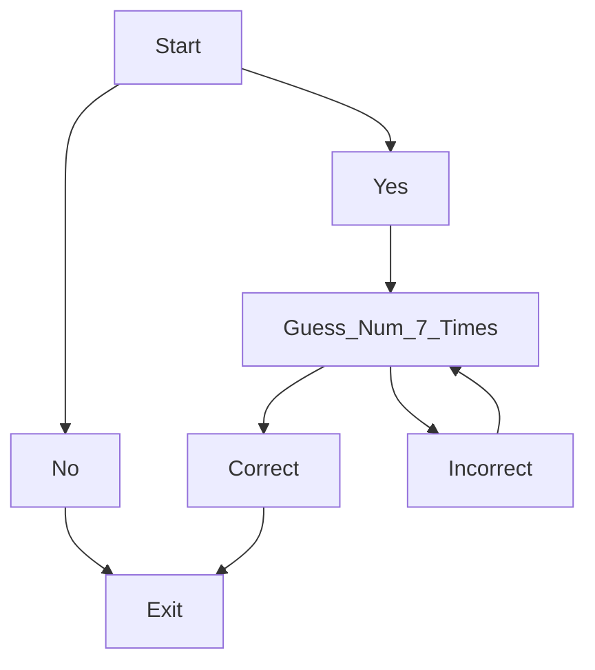

# random-guess-game
A simple random number guessing game

User gets 7 chances to correctly guess a number between '0' and '9'

```mermaid
graph TD;

    Start -->Yes;
    Start -->No;

    Yes -->Guess_Num_7_Times;
    No -->Exit;

    Guess_Num_7_Times -->Correct;
    Guess_Num_7_Times -->Incorrect;

    Correct -->Exit;

    Incorrect -->Guess_Num_7_Times;
```
